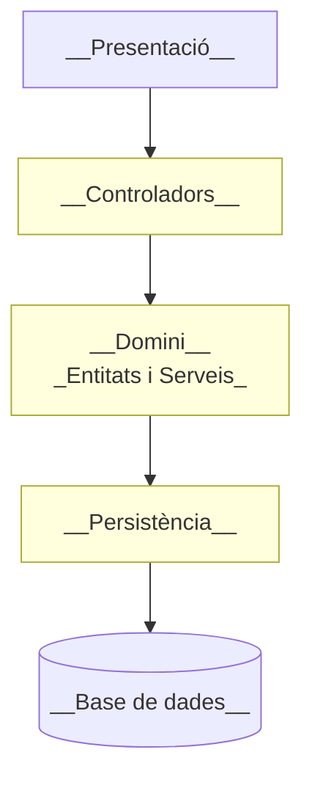

# :material-layers: Arquitectura per capes
La implementació de l'aplicació ha de seguir una __arquitectura per capes__,
que permeta separar les diferents responsabilitats de l'aplicació i facilite
la seua evolució i manteniment.

Les capes que s'han de definir són les següents:

- __Presentació__: Conté la interfície d'usuari de l'aplicació, que pot ser una
    aplicació web, una aplicació mòbil, etc. Aquesta capa és la que interactua
    amb l'usuari final.

- __Controladors__: Conté la lògica que s'encarrega de gestionar les peticions
    de l'usuari i de retornar les respostes adequades.

- __Domini__: Conté la lògica de negoci de l'aplicació, que s'encarrega de
    coordinar les diferents operacions que s'han de realitzar.

    Aquesta capa conté:

    - __Entitats__: Classes que representen els objectes de negoci de l'aplicació.
    - __Serveis__: Classes que contenen la lògica de negoci de l'aplicació.

- __Persistència__: Conté la lògica per gestionar l'accés a les dades de l'aplicació.

/// figure-caption
Arquitectura per capes de l'aplicació.
///
